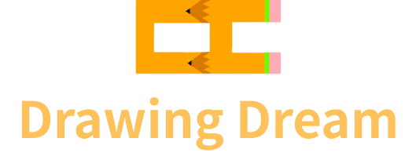

   
  
   
  <h1>세상에서 가장 편한 학교</h1>
   

## 목차

1. [**서비스 소개**](#1)
2. [**기술 스택**](#2)
3. [**시스템 아키텍처**](#3)
4. [**주요기능 및 데모영상**](#4)
5. [**UCC 보러가기**](#5)
6. [**개발 멤버 소개**](#6)
7. [**프로젝트 기간**](#7)
8. [**프로젝트 관련 문서**](#8)

 

## 💡 서비스 소개

### 세상에서 가장 편한 학교, 드로잉 드림에서 여러분의 꿈을 그려 보세요.

> 학교에 가지 않고 등교를 하는 세상이 찾아왔습니다.  
코로나-19가 앞당긴 비대면 시대, 이제는 너무나 익숙해져 버린 우리의 일상입니다.  
드로잉 드림은 단순한 비대면 수업 플랫폼을 넘어서 학생들의 생활 공간이 되는 학교라는 “공간”에 초점을 맞추었습니다.
>
#### 모두에게 필요한 맞춤형 학습 도우미, Drawing Dream에서 등교부터 하교까지 함께 하세요! 

[**🔗 'DrawingDream' 바로가기**](https://i6a607.p.ssafy.io/) 👈

 

## 🛠️ 기술 스택

 

 

   

 

 <b> 상세 기술스택 및 버전</b> 

| 구분       | 기술스택                    | 상세내용                 | 버전          |
| -------- | ----------------------- | -------------------- | ----------- |
| 공통     | 형상관리                    | Gitlab               | \-          |
|          | 이슈관리                    | Jira                 | \-          |
|          | 커뮤니케이션                  | Mattermost, Notion   | \-          |
| BackEnd  | DB                      | MySQL                | 5.7         |
|          |                         | JPA                  | \-          |
|          |                         | QueryDSL             | \-          |
|          | Java                    | Zulu                 | 8.33.0.1    |
|          | Spring                  | Spring               | 5.3.6       |
|          |                         | Spring Boot          | 2.4.5       |
|          | IDE                     | Eclipse              | JEE 2020-06 |
|          | Cloud Storage           | AWS S3               | \-          |
|          | Build                   | Gradle               | 7.3.2       |
|          | WebRTC                  | Kurento Media Server | 6.16        |
|          | WebRTC                  | Kurento              | \-          |
|          | API Docs                | Swagger2             | 3.0.0       |
| FrontEnd | HTML5                   |                      | \-          |
|          | CSS3                    |                      | \-          |
|          | JavaScript(ES6)         |                      |\-           |
|          | React                   | React                | 17.0.2      |
|          | React                   | Redux                | 7.2.6       |
|          | React                   | Redux-thunk          | 2.4.1       |
|          |                         | styled-components    | 5.3.3       |
|          |                         | framer-motion        | 6.0.0       |
|          |                         | apexcharts           | 3.33.0      |
|          |                         | toast-ui/react-editor      | 3.1.2       |
|          |                         | toast-ui/react-calendar    | 1.0.6       |
|          | WebSocket               | @stomp/stompjs       | 6.1.2       |
|          | WebSocket               | stompjs              | 2.3.3       |
|          | WebSocket               | sockjs-client        | 1.5.2       |
|          | IDE                     | Visual Studio Code   | 1.63.2      |
| Server   | 서버                      | AWS EC2              | \-          |
|          | 플랫폼                     | Ubuntu               | 20.04.3 LTS |
|          | 배포                      | Docker               | 20.10.12    |
|          | 배포                      | Jenkins              | 2.319.2     |

 

## 🗂️ 시스템 아키텍처

|                              시스템 구성                           |
| :------------------------------------------------------------------------------: |
|  |

|                              CI/CD 배포 흐름도                           |
| :------------------------------------------------------------------------------: |
|  |

|                              디렉토리 구조                       |
| :------------------------------------------------------------------------------: |
|  |

 

## 🖥️ 주요기능

### 온라인수업
- 선생님이 수업을 개설하면 해당 수업을 수강하는 학생이 수업에 참여할 수 있습니다.
- 사용자는 비디오, 오디오 ON/OFF를 설정할 수 있습니다.
- 선생님은 원활한 수업진행을 위해 화면공유를 할 수 있습니다. 

### 수업 알림
- 교사가 시간표에 맞춰 온라인 수업을 개설하면, 해당 수업을 수강하는 학생의 화면에 수업알림 모달창이 나타납니다.
- 또한, 수업 자료(첨부파일)를 확인할 수 있으며, [지금 들어가기] 버튼을 통해 해당 온라인수업에 입장할 수 있습니다.

|                              온라인 수업 및 수업알림                       |
| :---------------------------------------------------------------------------: |
|    |

### 채팅
- 학생, 선생님과 채팅이 가능하며, 지난 채팅 기록도 확인 가능합니다.
- 다른 유저가 채팅을 보내면 채팅 아이콘(말풍선)에 알림 표시가 나타납니다.

|                              채팅                       |
| :---------------------------------------------------------------------------: |
|    |

### 알림장
- 교사는 알림장(공지)을 작성할 수 있습니다.
- 카테고리 설정으로, 원하는 학생(학교 전체, 학년, 반)에게 보여지도록 설정합니다.
- toast-ui 에디터를 사용해서 글을 쉽게 편집할 수 있으며, Drag&Drop 으로 편리하게 첨부파일을 추가할 수 있습니다.  

|                              알림장(선생님)                  |
| :---------------------------------------------------------------------------: |
|    |

|                              알림장(학생)                  |
| :---------------------------------------------------------------------------: |
|    |
    
### 홈 화면(위젯) 설정 
- 메인 페이지에서 [설정 > 홈 화면 설정] 을 클릭하면 홈 화면에 배치되는 위젯들을 관리할 수 있습니다.
- 배치를 원하는 위젯을 원하는 순서로 구성할 수 있습니다.

|                              홈 화면 설정                      |
| :---------------------------------------------------------------------------: |
|    |

 

## 🎥 [UCC 보러가기](https://drawingdream-bucket.s3.ap-northeast-2.amazonaws.com/UCC+%EC%B5%9C%EC%A2%85%EB%B3%B8.mp4) 

 

## 👪 개발 멤버 소개 
<table>
    <tr>
        <td height="140px" align="center"> <a href="https://github.com/Jubi-in">
                👑 인주비  (Front-End) </a>  </td>
        <td height="140px" align="center"> <a href="https://github.com/unilion">
                🙂 장준범  (Front-End) </a>  </td>
        <td height="140px" align="center"> <a href="https://github.com/jejinmyeong">
                😆 제진명  (Front-End) </a>  </td>
        <td height="140px" align="center"> <a href="https://github.com/kibum414">
                😁 박기범  (Back-End) </a>  </td>
        <td height="140px" align="center"> <a href="https://github.com/changhyuns">
                🙄 손창현  (Back-End) </a>  </td>
        <td height="140px" align="center"> <a href="https://github.com/dayaeLee777">
                😶 이다예  (Back-End) </a>  </td>
    </tr>
    <tr>
        <td align="center">UI/UX React WebRTC WebSocket</td>
        <td align="center">UI/UX React</td>
        <td align="center">UI/UX React</td>
        <td align="center">REST API WebRTC WebSocket</td>
        <td align="center">REST API CI/CD Infra </td>
        <td align="center">REST API Database S3 </td>
    </tr>
</table>

 

## 📆 프로젝트 기간
### 22.1.10 ~ 22.2.18
- 기획 및 설계 : 22.1.10 ~ 19
- 프로젝트 구현 : 22.1.20 ~ 22.2.15
- 버그 수정 및 산출물 정리 : 22.2.16 ~ 18
 

## 📋 프로젝트 관련 문서
|  구분  |  링크  |
| :--------------- | :---------------: |
| 공통코드 | [공통코드 바로가기](/docs/공통코드.md) |
| 와이어프레임 | [와이어프레임 바로가기](/docs/와이어프레임.md) |
| 컨벤션목록 | [컨벤션목록 바로가기](/docs/컨벤션목록.md) |
| 테스트데이터 | [테스트데이터 바로가기](/docs/테스트데이터.md) |
| ERD | [ERD 바로가기](/docs/ERD.md) |
| 빌드/배포 | [빌드/배포 바로가기](/exec/01_서울_6반_A607_빌드및배포.pdf) |
| 외부서비스 정보 | [외부서비스 정보 바로가기](/exec/02_서울_6반_A607_외부서비스_정보.pdf) |
| 시연 시나리오 | [시연 시나리오 바로가기](/exec/04_서울_6반_A607_시연시나리오.pdf) |
